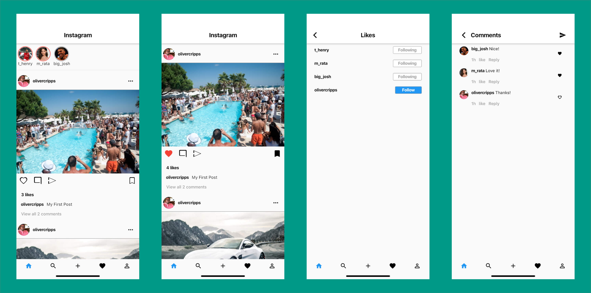

# instagram_clone

### [Welcome](#welcome) - [Screenshots](#screenshots) - [Process & Credits](#process--credits) - [Instructions](#instructions) - [Installing Flutter](#installing-flutter)

## Welcome

Welcome to my instagram UI clone built using Flutter. 

## Screenshots

## Process & Credits
The objective was to build the front end UI of the first page of the Instagram app. This is an imitation build following a One Day build video a this link: https://www.youtube.com/watch?v=E2uEfOls4e4

I have also reviewed the original developers source code for the project here: https://github.com/KalleHallden/Instagram 

The objective was to develop some further exposure to the exciting new Flutter framework following a previous project of building a clone of the Netflix UI. 

## Instructions

1. git clone https://github.com/ocripps24/instagram-clone
2. cd instagram-clone
3. open -a simulator.app (XCode must be installed on your computer to run the XCode simulator although a similar Android system can be used)
4. flutter run (You must point to your local flutter installation to use flutter commands (See below))

## Installing Flutter

1. Download the latest flutter package from: https://flutter.dev/docs/get-started/install
2. Optional - follow the recommended steps here to setup your editor
3. Add 'export PATH=[PATH_TO_FLUTTER_GIT_DIRECTORY]/flutter/bin:$PATH' to your ~/.bashrc file